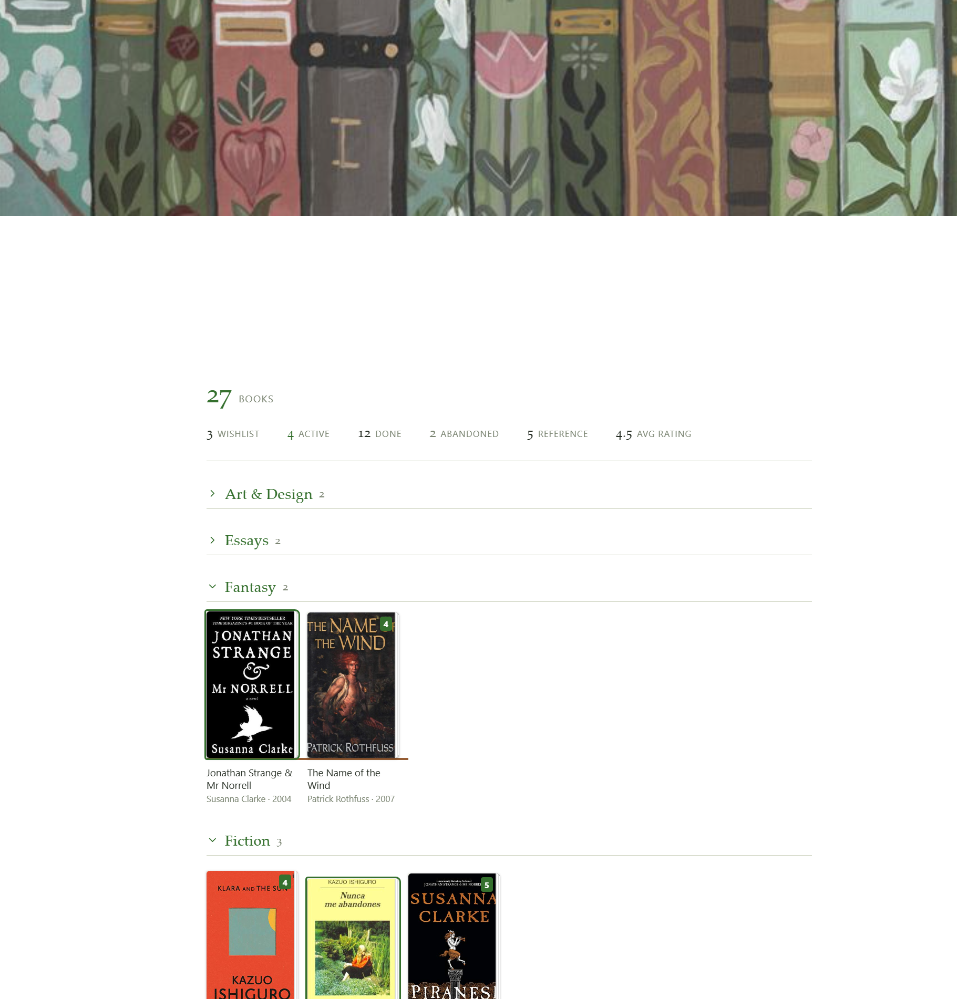

# Library Shelf

Library shelves for books and movies. Entries live as rows in a ledger note with an optional note attached

<p align="center">
  
  
</p>

## The ledger

Any note with a fenced `json` or `yaml` block shaped `{ library: [ … ] }`. The
rest of the note is left alone, so a ledger can carry prose and render its own
shelf.

````markdown
```yaml
library:
  - title: Hiroshima Diary
    author: Michihiko Hachiya
    shelf: Non-Fiction
    isbn: "9780807845479"
    status: active
  - title: Arrival
    director: Denis Villeneuve
    year: 2016
    shelf: Sci-Fi
    status: done
    rating: 5
    finished: [2024-08-19, 2026-01-04]
```
````
That's a complete entry. Only `title` is required, it will sort with any category.

### Fields

| Field | |
|---|---|
| `title` | Required |
| `author` / `director` | Whichever is set is displayed |
| `year` | |
| `status` | `wishlist` · `active` · `done` · `abandoned` · `reference` |
| `rating` | A number. Halves are fine |
| `finished` | A **list** of dates — a reread is another entry, not an overwrite |
| `shelf` | Free-text grouping |
| `cover` | Image URL. Overrides derivation |
| `isbn` / `asin` | Derives a cover when `cover` is unset |
| `note` | Path to a real note, once one exists |

## Adding entries

Command palette → **Add to library**. Pick a ledger, search, click a result; the
entry is appended to the ledger's data block in whatever format that block
already uses. "Don't look up" adds a bare title.

>**Books** search Open Library. No API key.
- **Films** search TMDB. Needs a free key in settings.

**1. Make a ledger.** New note `Library/Books.md`:

````markdown
```library-shelf
group: shelf
```

```yaml
library:
  - title: Everything Is F*cked
    author: Mark Manson
    shelf: Non-Fiction
    isbn: "9780062888433"
    status: done
    rating: 3.5
  - title: Miss Sunflower
    author: Sugano Manami
    shelf: Fiction
    isbn: "4840137390"
    status: wishlist
```
````
**2. Cross-ledger read.** New note `Library/Hub.md`:

````markdown
```library-shelf
from: [Library/Books]
where:
  status: done
layout: table
```
````
**3. Lookup and append.** Command palette → **Add to library**. Ledger
`Library/Books.md`, status `wishlist`, search `piranesi clarke`.

**4. Promotion.** Create `Library/notes/Piranesi.md`, then add
`note: Library/notes/Piranesi` to that entry.

### Promoting a row to a note

Add `note: Library/notes/Some Title` and create that file. The shelf marks the
entry with a dot and links its title.

**The note holds only your writing.** Author, cover, rating and status stay in
the ledger, so there's exactly one source of truth and nothing to drift.

## Rendering

For the library overview note: 

````markdown
```library-shelf
from: [Library/Books, Library/Films]
where:
  status: active
group: shelf
size: 96
```
````

With no `from`, the block reads the note it's in.

| Option | |
|---|---|
| `from` | Ledger path, or a list of them. Defaults to the current note |
| `where` | Field/value pairs. A list value matches any of them |
| `group` | Field to group by. `medium` is the ledger's own name, stamped on load |
| `sort` | Field name; `-` prefix for descending. Lists sort on their latest member |
| `limit` | Cap the number shown |
| `size` | Grid column width in px |
| `layout` | `grid` (default) or `table` |
| `columns` | Table columns. Default: `cover, title, author, year, rating` |
| `total` | Count above the shelf. `true` for a bare number, or a label like `books` |
| `stats` | With `total`, adds a breakdown by status and an average rating. Click a status to filter the shelf to it |
| `empty` | Text shown when nothing matches |

- Status drives appearance: `active` gets an accent outline,
`wishlist` dims until hover, `abandoned` desaturates. Editing a ledger repaints
every open shelf that reads it.

- `total` counts everything `where` matched, **before** `limit` trims the display —
a number that shrinks when you cap the grid isn't a total.

- **Group headers fold.** Click one to collapse its shelf. The state is keyed by
note and group name and kept in the plugin's data, so it survives a re-render
and a reload rather than springing back open every time a ledger changes.

## Appearance

Four CSS variables are the tuning knobs, settable on `.lib-shelf` in a snippet:

| Variable | |
|---|---|
| `--lib-plinth` | Shelf board colour. Defaults to the theme's third accent |
| `--lib-paper` | Fore-edge colour |
| `--lib-book-gap` | Space between books |
| `--lib-display` | Serif face for shelf names and counts |

## Covers

An explicit `cover` always wins. Otherwise, with **Derive covers** enabled:

- `isbn` → Open Library. Free, no key, but **coverage is patchy** — it misses a
  lot of manga and older printings.
- `asin` → Amazon's image CDN. Unofficial, but it resolves.

Anything that fails to load falls back to a titled card in the theme's accent
colour. Misses are common enough that this is a normal state, not an error.

## Settings

Ledger folder · default layout · cover width · derive covers · TMDB API key.

### Logic checks without Obsidian

`main.js` requires `obsidian` at load, so testing outside the app means stubbing
it. The parser, query layer, cover resolution and append round-trip are all
covered that way, with recorded output.

## Licence

MIT.
