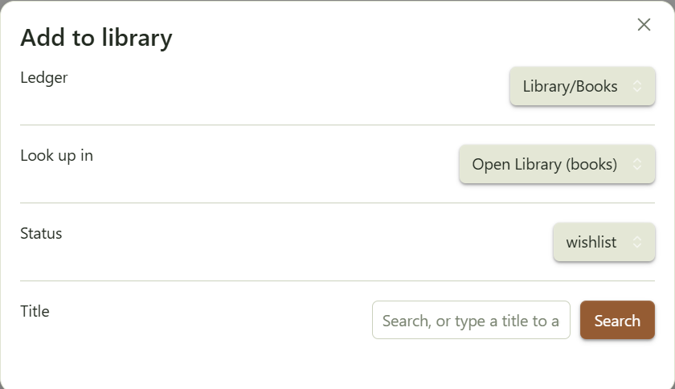

# Library Shelf

Library shelves for books and movies. Entries live as rows in a ledger note with an optional note attached

<p align="center">
  
  
</p>

## The ledger

Any note with a fenced `json` or `yaml` block shaped `{ library: [ … ] }`. The
rest of the note is left alone, so a ledger can carry prose and render its own
shelf.

````markdown
```yaml
library:
  - title: Hiroshima Diary
    author: Michihiko Hachiya
    shelf: Non-Fiction
    isbn: "9780807845479"
    status: active
  - title: Arrival
    director: Denis Villeneuve
    year: 2016
    shelf: Sci-Fi
    status: done
    rating: 5
    finished: [2024-08-19, 2026-01-04]
```
````
Only `title` is required, it will sort with any category.

### Fields

| Field | |
|---|---|
| `title` | Required |
| `author` / `director` | Whichever is set is displayed |
| `year` | |
| `status` | `wishlist` · `active` · `done` · `abandoned` · `reference` |
| `rating` | A number. Halves are fine |
| `finished` | A **list** of dates — a reread is another entry, not an overwrite |
| `shelf` | Free-text grouping |
| `cover` | Image URL. Overrides derivation |
| `isbn` / `asin` | Derives a cover when `cover` is unset |
| `note` | Path to a real note, once one exists |

## Adding entries

<p align="center">
  
  <br />
  <em>Command palette → <strong>Add to library</strong>. Pick a ledger, search, click a result; the entry is appended to the ledger's data block in whatever format that block already uses. "Don't look up" adds a bare title.</em>
</p>

>**Books** search Open Library. No API key.
> **Films** search TMDB. Needs a free key in settings.

**1. Make a Books and Movies note, seed with:**

````markdown
```library-shelf
group: shelf
total: books
stats: true
```

```yaml
library:
  - title: Everything Is F*cked
    author: Mark Manson
    shelf: Non-Fiction
    isbn: "9780062888433"
    status: done
    rating: 3.5
  - title: Miss Sunflower
    author: Sugano Manami
    shelf: Fiction
    isbn: "4840137390"
    status: wishlist
```
````
>The Movies note is the same with `total: movies`. Drop `total` and `stats` and the
>grid still renders, but you lose the count and the clickable status breakdown above it.

**2. Make Library hub note and seed with:**

````markdown
## Now

```library-shelf
from: [Library/Books, Library/Movies]
where:
  status: active
size: 96
empty: Nothing on the go.
```
````

**3. Lookup and append.** Command palette → **Add to library**. Ledger
`Library/Books.md`, status `wishlist`, search `your book`.

  - you get the entry instead of a second row — with its status, rating and sitting count — and three choices: record another sitting (appends today to `finished`), change its status, or add it as a separate entry anyway.

### Giving media its own note

Command palette → **Create note for a library entry**. 
  - Pick a ledger, click a title: it makes the note, drops a `library-card` block in it and writes `note:` inot ledger row. Entries that already have a note aren't listed.

By hand: create the note, add `note: <path>` to the corresponding ledger entry, and add the block below to the start of the note:

A `library-card` block renders the entry at the top of its own note:

````markdown
```library-card
```
````

## Library Hub View

A hub is one note of `library-shelf` blocks reading across every ledger, each under
its own heading. The whole thing, in one paste:

````markdown
## Now

```library-shelf
from: [Library/Books, Library/Movies]
where:
  status: active
size: 96
empty: Nothing on the go.
```

## Recently finished

```library-shelf
from: [Library/Books, Library/Movies]
where:
  status: done
sort: -finished
limit: 12
size: 96
```

## Everything

```library-shelf
from: [Library/Books, Library/Movies]
group: medium
size: 88
```

## Wishlist

```library-shelf
from: [Library/Books, Library/Movies]
where:
  status: wishlist
size: 88
```

## Abandoned

```library-shelf
from: [Library/Books, Library/Movies]
where:
  status: abandoned
layout: table
columns: [cover, title, author, year]
empty: Nothing abandoned. Suspicious.
```
````

With no `from`, the block reads the note it's in.

**Which entries to show**

| Option | |
|---|---|
| `from` | Which ledgers to read — `from: [Library/Books, Library/Movies]` |
| `where` | Only entries matching these fields — `where: {status: active}` |
| `sort` | What order — `sort: -finished` puts the most recent first |
| `limit` | Show at most this many |

**How to arrange them**

| Option | |
|---|---|
| `group` | Split into sections, each with a heading and a count — `group: shelf`. Entries missing the field land under "Unshelved" |
| `total` | The big number above the shelf — `total: books` prints "27 books" |
| `stats` | The status breakdown under that number. Click one to filter the shelf. Needs `total` |

**How it looks**

| Option | |
|---|---|
| `size` | How wide each cover is, in px |
| `layout` | `grid` (default) or `table` |
| `columns` | Which columns a table shows. Default: `cover, title, author, year, rating` |
| `empty` | What to say when nothing matches |

- `active` gets an accent outline
- `wishlist` dims until hover
- `abandoned` desaturates. Editing a ledger repaints every open shelf that reads it.

- `total` counts everything `where` matched, **before** `limit` trims the display —
a number that shrinks when you cap the grid isn't a total.

- **Group headers fold.** Click one to collapse its shelf.

## Appearance

Four CSS variables are the tuning knobs, settable on `.lib-shelf` in a snippet:

| Variable | |
|---|---|
| `--lib-plinth` | Shelf board colour. Defaults to the theme's third accent |
| `--lib-paper` | Fore-edge colour |
| `--lib-book-gap` | Space between books |
| `--lib-display` | Serif face for shelf names and counts |

## Covers

An explicit `cover` always wins. Otherwise, with **Derive covers** enabled:

- `isbn` → Open Library. Free, no key, but **coverage is patchy** — it misses a
  lot of manga and older printings.
- `asin` → Amazon's image CDN. Unofficial, but it resolves.

Anything that fails to load falls back to a titled card in the theme's accent
colour. Misses are common enough that this is a normal state, not an error.

## Settings

Ledger folder · notes folder · default layout · cover width · derive covers · TMDB API key.

### Logic checks without Obsidian

`main.js` requires `obsidian` at load, so testing outside the app means stubbing
it. The parser, query layer, cover resolution and append round-trip are all
covered that way, with recorded output.

## Licence

MIT.
