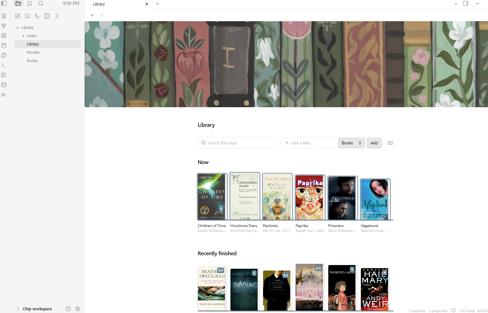

# Library Shelf

A shelf of your books and films in Obsidian: one ledger note per library, no file per title unless it earns one.

<p align="center">
  
</p>

## Getting started

Click the **library** icon in the ribbon (or run **Open library**). The first click
creates `Library/Books.md`, `Library/Movies.md` and a `Library/Library.md` hub, then
opens the hub. Every click after that just opens it.

## Adding

Type a title in the **Add a title…** box at the top of any library page and press
Enter. The lookup runs straight away — books search Open Library, films search
TMDB — and Enter again adds the top result. Click any other result to add that one
instead.

On a Books or Movies page the box adds to that page; on the hub, pick where from the
dropdown beside it. Adding a title that's already there offers to record another
read, change its status, or add it as a separate entry.

Films need a free TMDB API key. The first film search asks for it in the dialog;
paste it once and it's saved.

## Importing

The **import** button on the page bar (or **Import from Goodreads, StoryGraph or
Letterboxd**) takes your exported history and adds it to a ledger. Titles already
there are skipped, so importing twice is safe.

| Service | |
|---|---|
| Goodreads | My Books → Import and export → Export library |
| StoryGraph | Manage account → Export StoryGraph library |
| Letterboxd | Export your data, unzip, pick `watched`, `diary`, `ratings` and `watchlist` together |

## Searching

The **Search this page** box narrows every shelf on the page as you type. Every word
has to match something on the card: title, author or director, shelf, year, status,
or a date you finished it — `le guin`, `manga`, `ishiguro 2024`. Escape clears it.

## Editing from the shelf

Right-click a cover or a table row (long-press on mobile), or click a cover that has
no note:

| Action | |
|---|---|
| Wishlist · Active · Done · Abandoned · Reference | Sets the status |
| Finished again today | Adds today to `finished`, marks it done |
| Rate… | Halves from 0.5 to 5, or clear |
| Create note / Open note | Makes the entry's own note, or opens it |
| Remove from library | Asks first |

## The ledger

Everything lives in a fenced `yaml` (or `json`) block shaped `{ library: [ … ] }`
inside an ordinary note, so you can always edit it by hand too. The rest of the note
is left alone.

````markdown
```yaml
library:
  - title: Hiroshima Diary
    author: Michihiko Hachiya
    shelf: Non-Fiction
    isbn: "9780807845479"
    status: active
  - title: Arrival
    director: Denis Villeneuve
    year: 2016
    shelf: Sci-Fi
    status: done
    rating: 5
    finished: [2024-08-19, 2026-01-04]
```
````

| Field | |
|---|---|
| `title` | Required |
| `author` / `director` | Whichever is set is shown |
| `year` | |
| `status` | `wishlist` · `active` · `done` · `abandoned` · `reference` |
| `rating` | A number. Halves are fine |
| `finished` | A **list** of dates — a reread is another date, not a second row |
| `shelf` | Free-text grouping |
| `cover` | Image URL. Overrides derivation |
| `isbn` / `asin` | Derives a cover when `cover` is unset |
| `note` | Path to the entry's own note |

## Giving an entry its own note

Right-click → **Create note**, or run **Create note for a library entry**. It makes
the note, puts a `library-card` block at the top, and writes `note:` into the row.
The card shows the entry's cover, status, rating and read dates, always read from the ledger.

````markdown
```library-card
```
````

## Shelves and hubs

A `library-shelf` block draws a shelf anywhere. With no `from` it reads the note it's
in; a hub reads several ledgers. The hub the ribbon creates is a good starting point:

````markdown
## This year

```library-shelf
from: [Library/Books, Library/Movies]
year: current
sort: -finished
total: finished this year
goal: 30
```
````

**Which entries to show**

| Option | |
|---|---|
| `from` | Ledgers to read — `from: [Library/Books, Library/Movies]` |
| `where` | Only entries matching these fields — `where: {status: active}` |
| `year` | Only entries finished that year — `2026`, or `current` |
| `sort` | Order — `sort: -finished` puts the most recent first |
| `limit` | Show at most this many |

**How to arrange them**

| Option | |
|---|---|
| `group` | Sections with a heading and count — `group: shelf` |
| `total` | The big number above the shelf — `total: books` prints "27 books" |
| `goal` | Prints the total against it — "14 / 24" |
| `stats` | Status breakdown under the total. Click one to filter. Needs `total` |

**How it looks**

| Option | |
|---|---|
| `size` | Cover width in px |
| `layout` | `grid` (default) or `table` |
| `columns` | Table columns. Default: `cover, title, author, year, rating` |
| `empty` | What to say when nothing matches |

`active` covers get an accent outline, `wishlist` dims until hover, `abandoned`
desaturates. Group headers fold on click. Editing a ledger repaints every open shelf
that reads it.

The search and add boxes are a `library-bar` block. Put one at the top of any note
with shelves; `ledger: Library/Books` pins where its add box writes.

````markdown
```library-bar
```
````

## Covers

An explicit `cover` always wins. Otherwise, with **Derive covers** on:

- `isbn` → Open Library, then Amazon (a print book's ISBN-10 is its Amazon ID)
- `asin` → Amazon

Anything that still misses shows a titled card in the theme's accent colour.

## Appearance

Four CSS variables, settable on `.lib-shelf` in a snippet:

| Variable | |
|---|---|
| `--lib-plinth` | Shelf board colour. Defaults to the theme's third accent |
| `--lib-paper` | Fore-edge colour |
| `--lib-book-gap` | Space between books |
| `--lib-display` | Serif face for shelf names and counts |

## Settings

Ledger folder · notes folder · default layout · cover width · derive covers · TMDB API key.

## Licence

MIT
